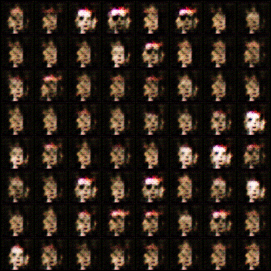

# GANFTs: Creating NFTs with Generative Models


GANFT is a novel implementation of generative models to create NFTs on a massive scale without any human effort.


### Ethereum address:
Since this project is open-source, any donations would be appreciated!
```
0xa1F7575E1FAC9ecA41989bAE8B83Eb6789fcF37b
```
