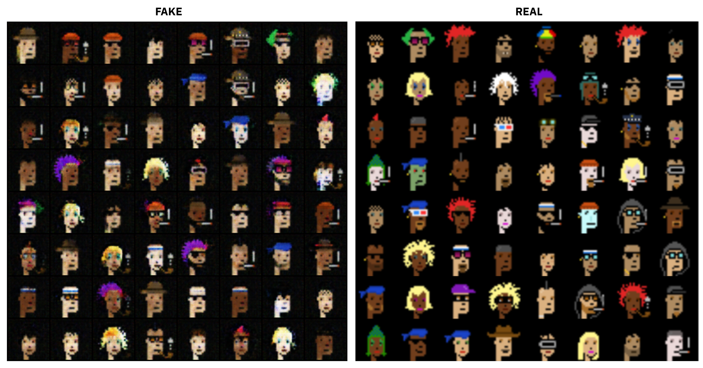

# GANFTs: Creating NFTs with Generative Models


GANFTs (GANs + NFTs) are an implementation of generative models to produce illustrations albeit for the purpose of minting NFTs. So far, this project aims to use GANs to create novel Crypto-Punk themed illustrations (very commonly used as NFTs). Code and newer styles/methods will be uploaded soon.


## V-1


#### Generator
```
generator = nn.Sequential(
nn.ConvTranspose2d(latent_size, 512, kernel_size=4, stride=1, padding=0, bias=False),
nn.BatchNorm2d(512),
nn.ReLU(True),
# out: 512 x 4 x 4

nn.ConvTranspose2d(512, 256, kernel_size=4, stride=2, padding=1, bias=False),
nn.BatchNorm2d(256),
nn.ReLU(True),
# out: 256 x 8 x 8

nn.ConvTranspose2d(256, 128, kernel_size=4, stride=2, padding=1, bias=False),
nn.BatchNorm2d(128),
nn.ReLU(True),
# out: 128 x 16 x 16

nn.ConvTranspose2d(128, 64, kernel_size=4, stride=2, padding=1, bias=False),
nn.BatchNorm2d(64),
nn.ReLU(True),
# out: 64 x 32 x 32

nn.ConvTranspose2d(64, 3, kernel_size=4, stride=2, padding=1, bias=False),
nn.Tanh()
# out: 3 x 64 x 64
)
```
#### Discriminator
```
discriminator = nn.Sequential(
nn.Conv2d(3, 64, kernel_size=4, stride=2, padding=1, bias=False),
nn.BatchNorm2d(64),
nn.LeakyReLU(0.2, inplace=True),
# out: 64 x 32 x 32

nn.Conv2d(64, 128, kernel_size=4, stride=2, padding=1, bias=False),
nn.BatchNorm2d(128),
nn.LeakyReLU(0.2, inplace=True),
# out: 128 x 16 x 16

nn.Conv2d(128, 256, kernel_size=4, stride=2, padding=1, bias=False),
nn.BatchNorm2d(256),
nn.LeakyReLU(0.2, inplace=True),
# out: 256 x 8 x 8

nn.Conv2d(256, 512, kernel_size=4, stride=2, padding=1, bias=False),
nn.BatchNorm2d(512),
nn.LeakyReLU(0.2, inplace=True),
# out: 512 x 4 x 4

nn.Conv2d(512, 1, kernel_size=4, stride=1, padding=0, bias=False),
# out: 1 x 1 x 1

nn.Flatten(),
nn.Sigmoid())
```

### Result



### Compute
`Tesla A-100 GPU` on Google Cloud.


## Ethereum address:
Since this project is open-source, any donations would be appreciated!
```
0xa1F7575E1FAC9ecA41989bAE8B83Eb6789fcF37b
```
# 
**I plan to make this repository grow further by introducing newer methods to get much better results, or potentially pivot towards other artistic styles. Feel free to send in a PR, Issue, or get in touch if you want to contribute.**

All open-source CryptoPunk illustrations used are credited to [LarvaLabs](https://larvalabs.com/cryptopunks).
